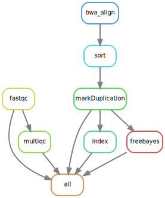

# variantcalling-snakemake-workflow

[Snakemake](https://snakemake.readthedocs.io/en/stable) is a workflow manager
that enables massively parallel and reproducible
analyses.
Snakemake allows to build workflow by joing discrete steps, with each step having input and output files.

## The Workflow 

The [`Snakefile`](Snakefile) contains rules which define the output files we want to generate and how to build them.
Snakemake automatically builds a directed acyclic graph (DAG) of jobs to figure
out the dependencies of each of the rules and what order to run them in.

This workflow process the raw files quality control `fastqc and multiqc`, calls `bwa mem` to aligned reads to 
the reference genome, calls `samtools sort` to sort the alinged reads, calls `picard.jar MarkDuplicates`  to mark duplicate reads, calls `samtools index` to index sorted and marked duplicate reads, and finally calls `freebayes` to detect genetic variant and outputs a VCF file. 

## Tools need to run the pipeline

- [FastQC](https://www.bioinformatics.babraham.ac.uk/projects/fastqc/)
- [MultiQC](https://multiqc.info/docs/)
- [BWA-MEM](http://bio-bwa.sourceforge.net/)
- [Picard](https://broadinstitute.github.io/picard/)
- [Freebayes](https://github.com/freebayes/freebayes)